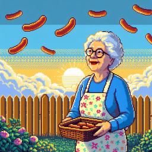

## Wieners from Heaven: Maple Syrup Edition 🌭 🇨🇦

### Overview 🌤️

Get ready to dive into the delightfully wacky world of "Wieners from Heaven," where classic 16-bit gaming collides with absurd platforming. In this side-scrolling saga, players embark on an epic quest as 'Nan', a spunky grandmother on a mission to provide supper for her grandchildren. She has to venture far from home, walking across Canada while jumping and dodging her way through a barrage of wieners raining from the sky.

### Requirements 👈

- Any modern web browsers and hardware, including smartphones and tablets
- Game controller support (optional)

### Goals 🎯

1. Learn JavaScript
2. Evaluate scope required to create a full-length game
3. Gauge interest from the gaming community for the theme by submitting to an itch.io game jam

### Work-in-Progress 🚧

> ⛔️ **WARNING**: This game is incomplete, in active development (Feb-Mar 2024), and contains many, MANY bugs and broken or missing functionality/features. _It will probably be the opposite of fun and it may even crash your web browser._ 😳

⚠️ [Play Wieners From Heaven: Maple Syrup Edition](https://stevengranter.github.io/wieners-maple-syrup)

### Bonus Items

#### Official Game Soundtrack 💿

Track List

[i = "da b'y"](https://soundcloud.com/sansunicorn/i-da-by) (released February 18, 2024)
